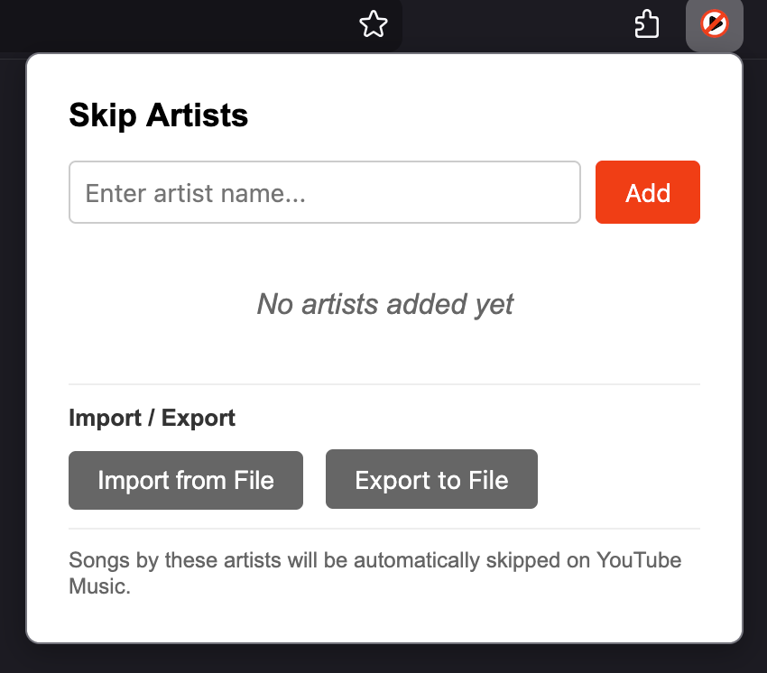

# Skip that Noise

**Version:** [<!-- version -->0.3.0<!-- /version -->](https://github.com/L-K-M/skip-that-noise/releases/latest)

A Firefox extension that automatically skips songs by specific artists on YouTube Music.



> [!IMPORTANT]
> LLM Disclosure: This project was developed with the assistance of large language models (AI coding tools).

# Installation

To install the extension permanently, you need to package and sign it. The tooling is [`web-ext`](https://extensionworkshop.com/documentation/develop/web-ext-command-reference/), Mozilla's official command-line tool, driven through `npm` scripts.

## 1. Install the tooling:

```bash
npm install
```

## 2. Setup your Mozilla Add-ons account:

Register on [addons.mozilla.org](https://addons.mozilla.org). Then generate API credentials from [addons.mozilla.org/en-US/developers/addon/api/key/](https://addons.mozilla.org/en-US/developers/addon/api/key/).

At this point, you should also open `manifest.json` and set the `browser_specific_settings.gecko.id` field to a unique identifier for your extension.

## 3. Build (and sign) the extension:

Build an unsigned `.zip`:

```bash
npm run build
```

To produce a signed `.xpi` for permanent installation, export your AMO credentials and run the signing script:

```bash
export WEB_EXT_API_KEY="your-jwt-issuer"
export WEB_EXT_API_SECRET="your-jwt-secret"
npm run sign
```

Both write to `web-ext-artifacts/`. The same signing happens automatically in CI when a `v*` tag is pushed and the `AMO_JWT_ISSUER` / `AMO_JWT_SECRET` repository secrets are configured — see [CICD.md](CICD.md).

## 4. Install the signed extension:

You can now go to Firefox's Extension Manager (`about:addons`), click on the gear icon, and select "Install Add-on From File..." to install the signed extension.

# Testing During Development

Run the extension in a temporary Firefox instance:

```bash
npm run start
```

# Linting

Check for common issues:

```bash
npm run lint
```

# Releases

Releases are cut by pushing a version tag. The shared [release tool](https://github.com/L-K-M/release-tool) does it in one step:

```bash
scripts/release.sh 1.2.3 --push     # bump manifest.json, commit, tag v1.2.3, and push
```

Pushing the `v*` tag triggers [`.github/workflows/release.yml`](.github/workflows/release.yml), which verifies the tag matches `manifest.json`, packages the extension with `web-ext` (signing through Mozilla Add-ons when the `AMO_JWT_ISSUER` / `AMO_JWT_SECRET` secrets are set, otherwise an unsigned `.zip`), and publishes a GitHub Release with auto-generated notes. Every pull request and push to `main` is linted by [`.github/workflows/ci.yml`](.github/workflows/ci.yml). The `<!-- version -->` marker near the top of this file is kept in step by the release tool. See [CICD.md](CICD.md) for the full pipeline.
